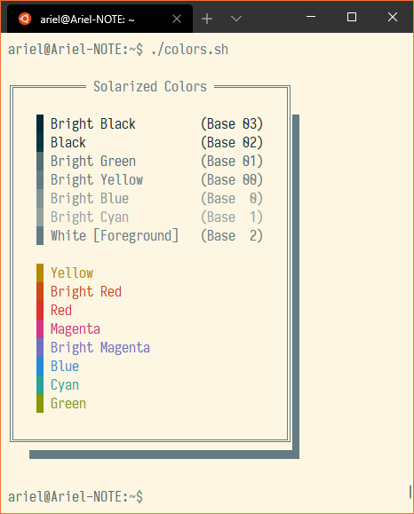
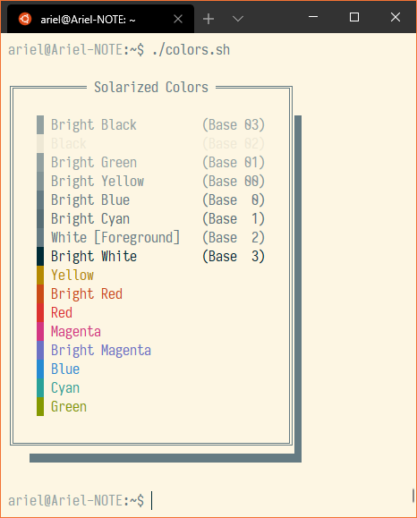
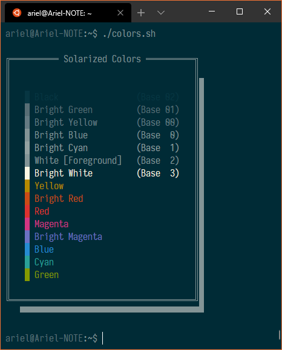
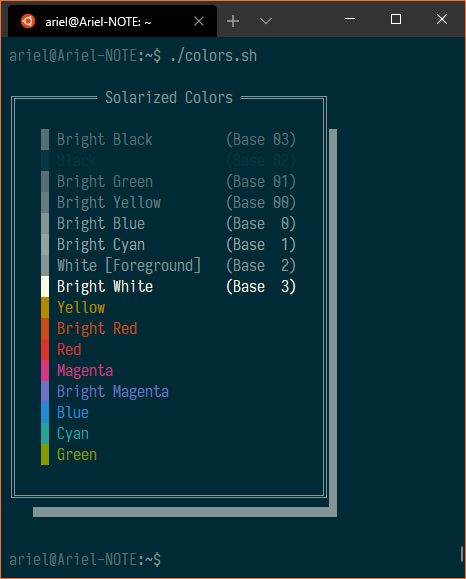
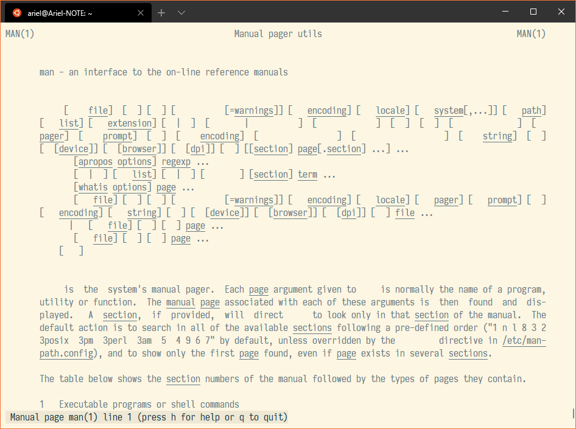
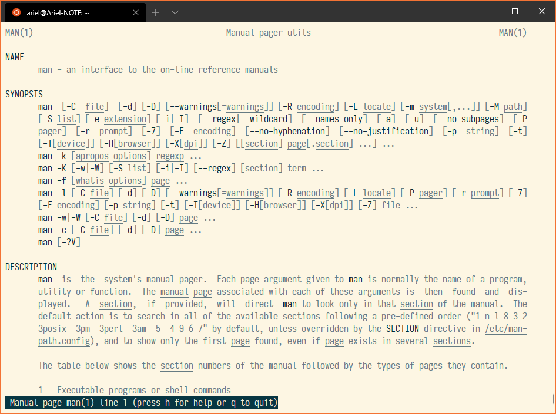
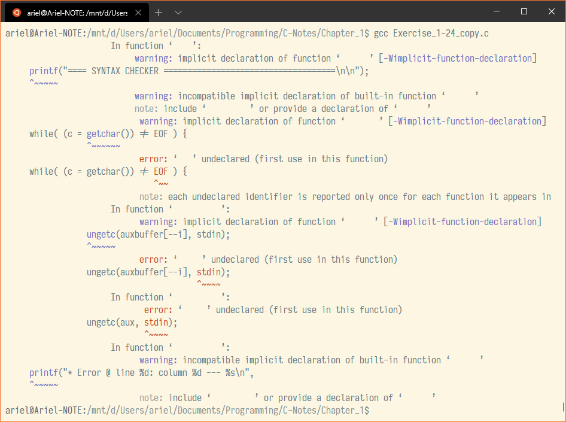
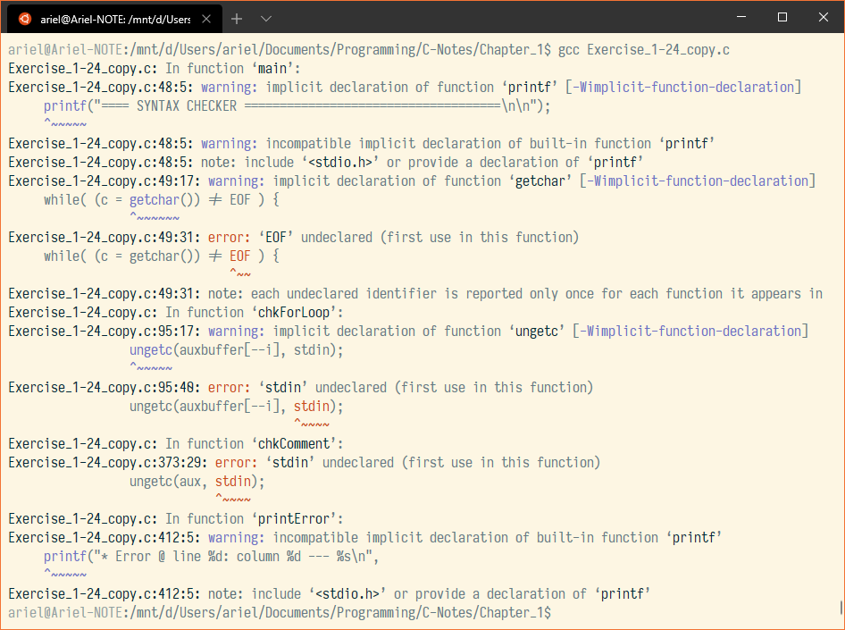
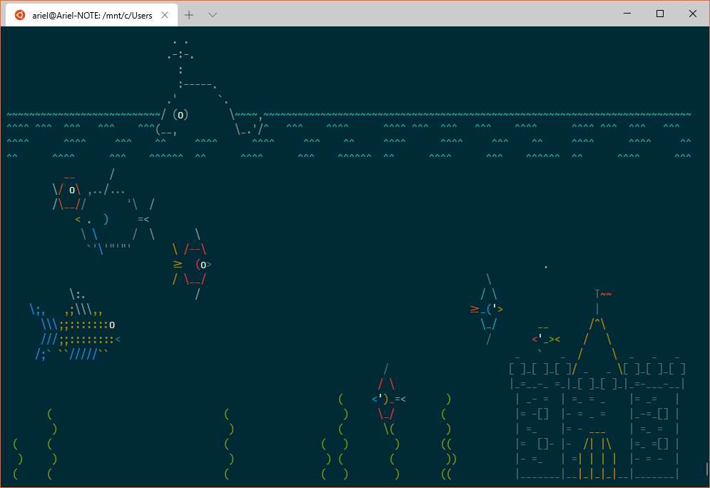

# solarized-terminal-fixed
> Readable Solarized Light/Dark theme for use in Windows Terminal or VS Code

This is a version of the popular [Solarized theme by Ethan
Schoonover](https://ethanschoonover.com/solarized/) that fixes some problems of
unreadable colors on terminal emulators.

 Default | Fixed
:-------:|:-----:
 | 
 | 

Due to legacy, some colors of the [ANSI escape code
standard](https://en.wikipedia.org/wiki/ANSI_escape_code#Colors) are considered
hardcoded, such as colors 0 (`Black`) and 7 (`White`): this is a frequent problem with `Bright Black`, as it's assumed to
be always rendered as a shade of gray. In the default Solarized theme it can be
hard to read text in this color, as it's very similar to the background; this
is quite apparent when reading `man` pages or compile errors from GCC using the
Light variant.

* Example 0:

 Light Default | Light Fixed
:-------------:|:-----------:
 | 

 

* Example 1:

 Light Default | Light Fixed
:-------------:|:-----------:
 | 

 

* Example 2:

 Dark Default | Dark Fixed
:-------------:|:-----------:
 | 

This fixes some of the issues by reversing the light color pallete and taking
some clues from Visual Studio Code's built-in theme, such as, setting `Bright
Black` to the same color as `Bright Green`, and the foreground color as `Bright
Blue`.

The final result looks and feels like the original Solarized theme, but only
more compatible with terminal aplications. I hope you'll like it!

## How to Use

### Windows Terminal color schemes

Copy the theme content from `windowsterminal/` and paste the content to your
profiles.json in the corresponding place (`"schemes"`). Then specify the name
of your theme by `"colorScheme"` in `"profiles"`.

### Visual Studio Code color schemes

Copy the theme content from `vscode/` and paste the content to your
`UserSettings.json.`

## Credits

Made by [ANK-dev](https://github.com/ANK-dev)
